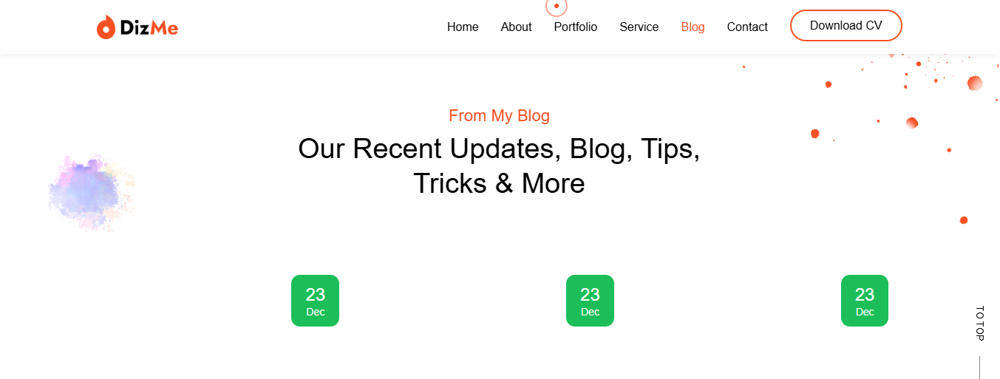

# dizme-hw — Landing Page on WordPress

This project is a personalized landing page I created using WordPress.

🎯 **Project goal:**  
To practice converting a ready-made HTML template into the WordPress CMS — adapting the design, customizing the structure, and breaking it down into dynamic components.

📁 **The repository includes:**

- The `wp-content/` folder with my custom files (theme, plugins, media)
- Example configuration file: `wp-config-sample.php`
- Original static site template (HTML, CSS, JS, images) in the `original-template/` folder

⚠️ **Note:**  
Due to a local server reinstallation, the original database was lost.  
The project is not ready to run “out of the box”, but all file structures are preserved for reference and evaluation of the work done.

🧱 **What I did in this project:**

- Manually transferred an HTML template into a WordPress environment
- Recreated the page structure from several core sections:
  - Header with navigation
  - Hero section with background image and CTA
  - Service/feature sections
  - Image gallery
  - Contact form
  - Footer with social media links
- Adapted the template styles and logic to fit WordPress
- Preserved all files and source templates to demonstrate the HTML-to-CMS conversion process

📷 **Page Previews:**

👩‍💻 **Author:** Veronika Pavuk
